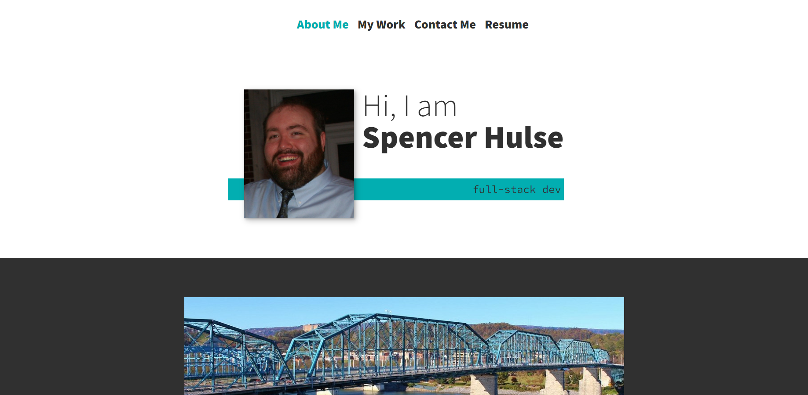

# reacting-to-me

## Description

This is a version of my portfolio created using React. It utilizes the necessary components and practices to be a SPA. The application includes an about me page, a page to showcase some of my best work, a contact form page, and a page that lists my skills and links to a copy of my resume.

The entire app uses React components, which are rendered as needed. The current section a visitor is on is stored using state, which ensures only certain parts of the application are rendered.

The about me page is the main page of the application and introduces me.

On the page that demonstrates my work, nine projects are listed, along with the technologies used and links to the repo and the deployed application. It is set to reveal the links and technologies used when hovered over, though there is a hover: none media query used to ensure the links show up on mobile devices.

The contact form uses nodemailer to email me a copy of the message entered into the form.

Lastly, the resume page includes a link to a copy of my resume and a list of some of my proficiencies.

A lot of work also went into make the site mobile-first and responsive, including the addition of a hamburger on smaller devices to replace the header. There is also the revealed links when hover is not possible, an overall responsive design, and different pictures and layouts in certain areas to match the needs of the user.

A live version of the app can be found on [GitHub Pages](https://spencerhulse.github.io/reacting-to-me/).

## Table of Contents

- [Installation](#installation)
- [Usage](#usage)
- [Contributing](#contributing)
- [Questions](#questions)

## Installation

To install, simply clone the repo and packages.

## Usage

Launch using React with "npm start".

## Contributing

The project is not accepting any contributions at this time.

## Questions

If you have any questions, feel free to contact me. Thanks!

Email: hulse.spencer@gmail.com

GitHub: [SpencerHulse](https://github.com/SpencerHulse)
